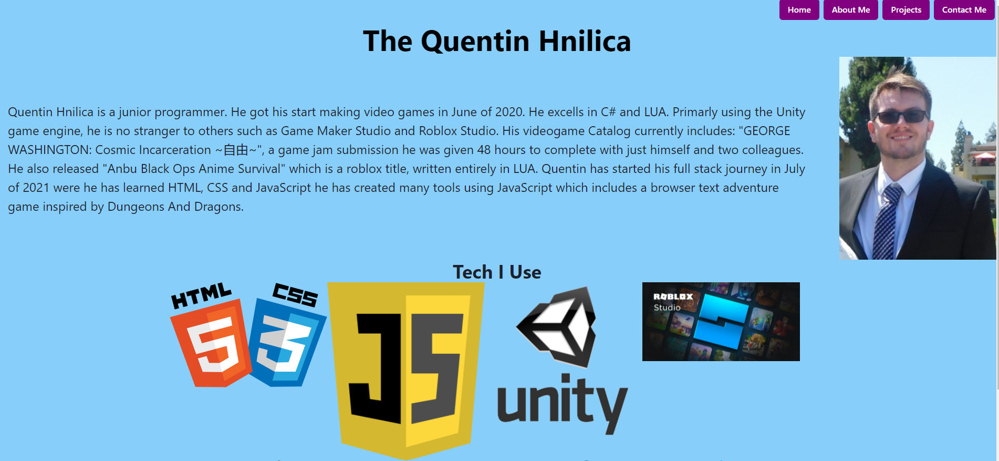

# My React Portfolio

  ## Description
  Using react, I redo my portfolio

  # Table of Contents
 [Installation](#install)
 [Test](#test)
 [Usage](#usage)
 [Tech](#tech)
 [Deployment](#deployment)
 [License](#license)
 [Contributions](#contributions)
 [Contact](#contact)

  
  
  
  ## Installation
  npm i
  
  ## Test
  npm test

  ## Usage
  1. Open Link and navigate the pages to your desire
  2. View resume and social links on the homepage/footer
  3. View the about me and projects to learn more, and click contact to message me directly

  ## Tech
  - JavaScript
  - React

  ## Deployment
  https://quentinhnilica.github.io/react-portfolio/

  ## License  (https://opensource.org/licenses/MIT)

  ## Contributions
  This was a solo Project
  
  ## Contact
  for any questions or inquaries send me an email at Quentinhnilica@gmail.com and follow [my Github](https://www.github.com/Quentinhnilica)
